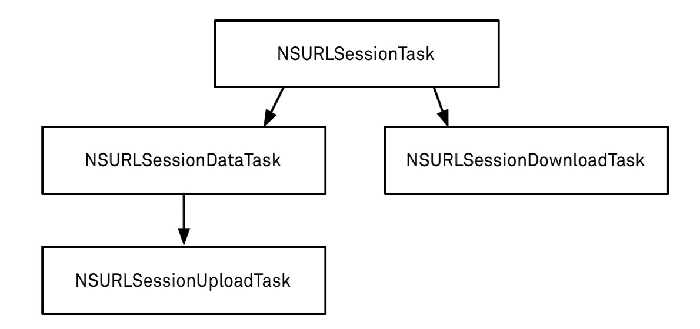

# iOS网络编程基础

####一. TCP／IP

####二. HTTP-请求
HTTP协议规定：1个完整的由客户端发给服务器的HTTP请求中包含以下内容  

**请求行**：  
包含了请求方法(GET/POST)，请求资源路径(.../image/01.jpg)，HTTP协议版本(HTTP/1.1)  

**请求头**:  
包含了对客户端的请求描述，客户端请求的主机地址等信息  

```objc
1. Host: 127.0.0.1:8080 //客户端像访问的服务器主机地址  
2. User-Agent: Mozilla/5.0(Macintosh;Intel Mac OS X 10.9) Firefox/30.0 //客户端的类型，客户端的软件环境  
3. Accept: text/html,*/*  //客户端所能接收的数据类型
4. Accept-Language: zh-cn  //客户端的语言环境
5. Accept-Encoding: gzip  //客户端支持的数据压缩格式
```
**请求体**:  
请求的数据:requst.HTTPBody = [@"username=LitterL&pwd=123" dataUsingEncoding:NSUTF8StringEncoding];


####三. HTTP-相应
HTTP协议规定：1个完整的HTTP相应中包含以下内容   

**状态行**：  
包含了HTTP协议版本(HTTP/1.1)，状态码(200)，状态英文名称(OK)   

常见的状态码：

| 状态码  | 英文名称  | 中文描述 |
|:------------- |:---------------:| -------------:|
| 200 | OK | 请求成功 |
| 400 | centered  | 客户端请求的语法错误，服务器无法解析 |
| 404 | Not Found | 服务器无法根据客户端的请求找到资源 |
| 500 | Internal Server Error |  服务器内部错误，无法完成请求 |

**响应头**:  
包含了对服务器的描述，对返回数据的描述  

```objc
1. Server:Apache-Coyote/1.1  //服务器的类型  
2. Content-Type:image/jpeg  //返回数据的类型 
3. Content-Length:54412  //返回数据的长度
4. Data:Mon,23 jun 2014 12:54:52 GMT //相应的时间
```  

**响应体**:  
服务器返回给客户端的具体数据，比如文件数据   

####四. 实战基础  

1. NSURLConnection:用法简单，最古老经典最直接的一种技术  
2. NSURLSession:iOS7新出的技术，功能比NSURLConnection更强大  
3. CFNetwork:NSURL*的底层,纯c语言  

第三方:  
AFNetworking  

####五.NSURLConnection  

##### 1.NSURLConnect常用类
1. **NSURL**: 用于请求地址  
2. **NSURLRequest**: 用于封装一个请求，保存发给服务器的全部数据，包括NSURL对象，**请求方式**，**请求头**及**请求体**等。默认的请求方式是GET
3. **NSMutableURLRequest**:  
   NSURLRequest的子类，常用方法有:  
   设置请求超时等待时间:``-(void) setTimeoutInterval:(NSTimeInterval) seconds;``  
   设置请求方法:``-(void) setHTTPMethod:(NSString *) method`` [GET 或 POST]   
   设置请求头: ``-(void) setValue:(NSString*) value forHTTPHeaderField:(NSString*) field``  
   设置请求体：``-(void) setHTTPBBody:(NSData*) data;``
    
4. **NSURLConnection**:  
   负责发送请求，建立客户端和服务器的连接。发送NSURLRequest的数据给服务器，并收集来自服务器的响应数据。 

##### 2.使用NSURLConnection发送同步请求的步骤

1. 创建一个NSURL对象，设置请求路径
2. 设置请求对象NSRequest，设置请求头和请求体
3. 用NSURLConnection发送NSURLRequest(发送请求)  

```objc
#define JSON_URL @"http://new.api.bandu.cn/book/listofgrade"
- (void)sync_connection{
    /*
     *1.创建NSURL对象
     *2.创建NSURLRequest对象，默认是GET
     *3.使用NSURLConnection发送请求
     */
    NSURL *url = [NSURL URLWithString:JSON_URL];
    NSURLRequest *request = [NSURLRequest requestWithURL:url];
    
    /*
     *response:响应头,状态行
     *error:发送请求时出现的错误
     *data:响应内容
     */
    NSURLResponse *response = nil;
    NSError *error = nil;
    NSData *data = [NSURLConnection sendSynchronousRequest:request returningResponse:&response error:&error];
    
    if(!error){
        NSLog(@"---Header---:%@",response);

        NSString *string = [[NSString alloc] initWithData:data encoding:NSUTF8StringEncoding];
        NSLog(@"---Content---:%@",string);
    }else{
        NSLog(@"---Error---:%@",error);
    }
}
```  

返回内容:   

```objc
2017-02-22 20:53:57.630 XXDownload[31032:366904] ---Header---:<NSHTTPURLResponse: 0x608000223940>
 { URL: http://new.api.bandu.cn/book/listofgrade }
 { status code: 200, headers {
    Connection = close;
    "Content-Type" = "text/html; charset=UTF-8";
    Date = "Wed, 22 Feb 2017 12:53:57 GMT";
    Server = "nginx/1.8.0";
    "Transfer-Encoding" = Identity;
    "X-Powered-By" = "PHP/5.6.12";
} }
2017-02-22 20:53:57.631 XXDownload[31032:366904] ---Content---:{"status":1,"data":{"list":[{"version":"\u4eba\u6559PEP\u7248","list":...
```  


##### 3.异步
```objc
#pragma mark- AsyncConnection Block
- (void)async_connectionWithCompletion:(void (^)())completion{
    /*
     *1.创建NSURL对象
     *2.创建NSURLRequest对象，默认是GET
     *3.使用NSURLConnection发送请求
     */
    NSURL *url = [NSURL URLWithString:JSON_URL];
    NSURLRequest *request = [NSURLRequest requestWithURL:url];
    
    /*
     *response:响应头,状态行
     *error:发送请求时出现的错误
     *data:响应内容
     */
#pragma clang diagnostic push
#pragma clang diagnostic ignored"-Wdeprecated-declarations"
    [NSURLConnection sendAsynchronousRequest:request queue:[[NSOperationQueue alloc] init] completionHandler:^(NSURLResponse * _Nullable response, NSData * _Nullable data, NSError * _Nullable connectionError) {
#pragma clang diagnostic pop
        if(connectionError == nil){
            NSLog(@"--Header--:%@",response);
            
            NSString *string = [[NSString alloc] initWithData:data encoding:NSUTF8StringEncoding];
            NSLog(@"---Content---:%@",string);
        }
        NSLog(@"currentThread=%@",[NSThread currentThread]);
        if (completion) {
            completion();
        }
    }];
}
```

####五. NSURLSession

#####1. 使用步骤
1. 创建NSURLSession的会话  
2. 根据会话创建Task
3. 执行Task

#####2. Task的类型


NSURLSessionDataTask:请求数据  
NSURLSessionUploadTask:上传  
NSURLSessionDownloadTask:下载  

获取NSURLSession的方法：  

```objc
[NSURLSession sharedSession];  
+ (NSURLSession *)sessionWithConfiguration:(NSURLSessionConfiguration *)configuration;   
+ (NSURLSession *)sessionWithConfiguration:(NSURLSessionConfiguration *)configuration  
  delegate:(nullable id <NSURLSessionDelegate>)delegate   
  delegateQueue:(nullable NSOperationQueue *)queue;
```

#####3. NSURLSessionTask
获常见方法  

```objc
- (void)suspend;
- (void)resume;
- (void)cancel;
- (void)cancelByProducingResumeData:(void (^)(NSData *resumeData)) completionHandler;
```


#####4. Get请求用block执行
```objc
#pragma mark- Session Block Get
- (void)async_sessionDataTaskGet{
    NSURL *url = [NSURL URLWithString:JSON_URL];
    NSURLRequest *request = [NSURLRequest requestWithURL:url];
    
    /*
     *1.创建Session
     *2.根据创建任务
     *3.发送任务
     */
    NSURLSession *session = [NSURLSession sharedSession];
    
    NSURLSessionTask *dataTask = [session dataTaskWithRequest:request completionHandler:^(NSData * _Nullable data, NSURLResponse * _Nullable response, NSError * _Nullable error) {
        NSLog(@"--%@--",[NSThread currentThread]);
        
        if(error == nil){
            id objc = [NSJSONSerialization JSONObjectWithData:data options:NSJSONReadingMutableContainers error:nil];
            NSLog(@"%@",objc);
        }
        
        [[NSOperationQueue mainQueue] addOperationWithBlock:^{
            NSLog(@"我回到了主线程!");
        }];
    }];
    
    [dataTask resume];
}
```  

#####5. Post请求用block执行
```objc
#pragma mark- Session Block Post
- (void)async_sessionDataTaskPost{
    NSURL *url = [NSURL URLWithString:JSON_URL_FRONT];
    NSMutableURLRequest *request = [NSMutableURLRequest requestWithURL:url];
    request.HTTPMethod = @"POST";
    request.HTTPBody = [@"id=2" dataUsingEncoding:NSUTF8StringEncoding];
    /*
     *1.创建Session
     *2.根据创建任务
     *3.发送任务
     */
    NSURLSession *session = [NSURLSession sharedSession];
    
    NSURLSessionDataTask *dataTask = [session dataTaskWithRequest:request completionHandler:^(NSData * _Nullable data, NSURLResponse * _Nullable response, NSError * _Nullable error) {
        NSThread *currentThead1 = [NSThread currentThread];
        NSOperationQueue *currentQueue1 = [NSOperationQueue currentQueue];
        
        NSLog(@"--CurrentThead1%@--",currentThead1);
        NSLog(@"--OperationQueue1--:%@",currentQueue1);
        
        [currentQueue1 addOperationWithBlock:^{
            NSThread *currentThead2 = [NSThread currentThread];
            NSOperationQueue *currentQueue2 = [NSOperationQueue currentQueue];
            
            NSLog(@"--CurrentThead2%@--",currentThead2);
            NSLog(@"--OperationQueue2--:%@",currentQueue2);
            
            if([currentThead1 isEqual:currentThead2]){
                NSLog(@"Thread Equal YES!");
            }
            
            if([currentQueue1 isEqual:currentQueue2]){
                NSLog(@"Queue Equal YES!");
            }
        }];
        
//        if(error == nil){
//            id objc = [NSJSONSerialization JSONObjectWithData:data options:NSJSONReadingMutableContainers error:nil];
//            NSLog(@"%@",objc);
//        }
        
//        [[NSOperationQueue mainQueue] addOperationWithBlock:^{
//            NSLog(@"我回到了主线程!");
//        }];
        

    }];
    
    [dataTask resume];
}
```

#####6. delegate委托
```objc
- (void)async_sessionDataTaskPostDelegate{
    NSURL *url = [NSURL URLWithString:JSON_URL];
    NSMutableURLRequest *request = [NSMutableURLRequest requestWithURL:url];

//    defaultSessionConfiguration:默认
//    ephemeralSessionConfiguration;无痕
//    backgroundSessionConfigurationWithIdentifier 后台
    NSURLSession *session = [NSURLSession sessionWithConfiguration:[NSURLSessionConfiguration defaultSessionConfiguration] delegate:self delegateQueue:[NSOperationQueue mainQueue]];
    NSURLSessionTask *dataTask = [session dataTaskWithRequest:request];
    
    [dataTask resume];
}

- (void)URLSession:(NSURLSession *)session dataTask:(NSURLSessionDataTask *)dataTask
didReceiveResponse:(NSURLResponse *)response
 completionHandler:(void (^)(NSURLSessionResponseDisposition disposition))completionHandler{
    NSLog(@"Response=%@",response);
    if(_mulData){
        _mulData.length = 0;
    }else{
        _mulData = [NSMutableData data];
    }
    
    if(completionHandler){
        completionHandler(NSURLSessionResponseAllow);
    }
}

- (void)URLSession:(NSURLSession *)session dataTask:(NSURLSessionDataTask *)dataTask
    didReceiveData:(NSData *)data{
    [_mulData appendData:data];
}

- (void)URLSession:(NSURLSession *)session task:(NSURLSessionTask *)task
didCompleteWithError:(nullable NSError *)error{
    if(error == nil){
        id objc = [NSJSONSerialization JSONObjectWithData:_mulData options:NSJSONReadingMutableContainers error:nil];
        NSLog(@"--%@",objc);
    }
}
```


